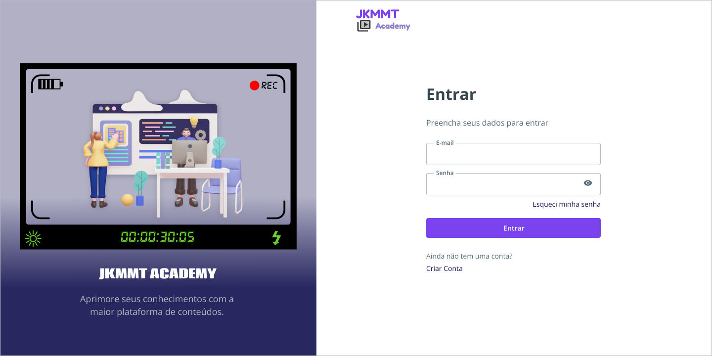
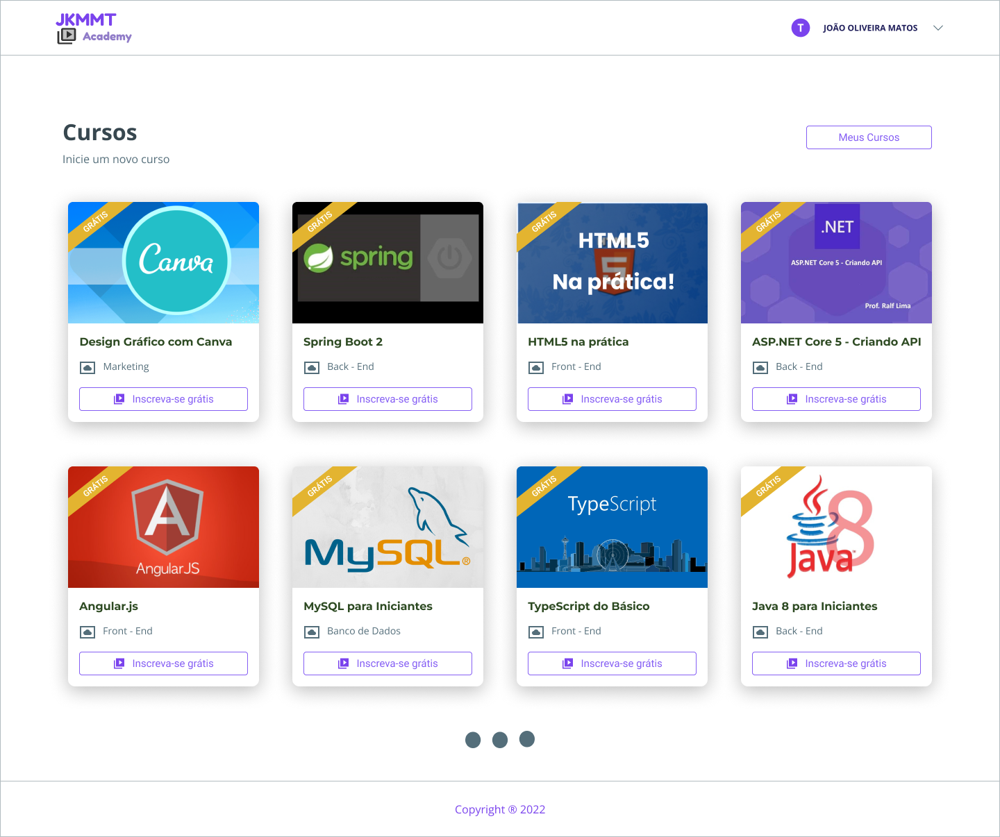
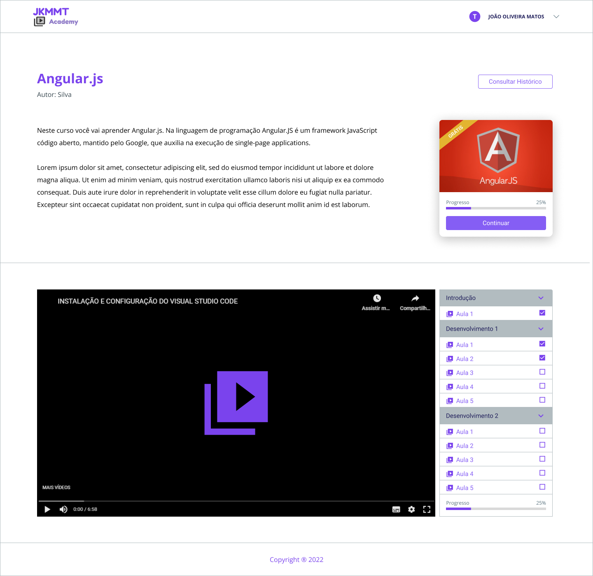

<div style="display: inline_block" align="center">
  <br>
    
  <br>
</div>

<br>

## 📰 Projeto

O **JKMMT Academy** é uma aplicação desenvolvida para a **2ª entrega do Projeto Integrador**. O desafio neste semestre é fazer com que a ideia desenvolvida pelo grupo na 1ª entrega possa ser viabilizada através de um aplicativo baseado nas premissas de desenvolvimento web.

## Grupo 08

🧑💻  [Josias Martins Caitano](https://github.com/josiasmartins)

🧑💻  [Kleiton Tavares Melo](https://github.com/KleitonTavares)

👧💻  [Mariah Guedes Hermínio de Lima](https://github.com/)

👧💻  [Milena Da Silva Martins Machado](https://github.com/)

🧑💻  [Thiago Barbosa de Araujo](https://github.com/thiagoaraujodev)

<br>

## 🚀 Telas da Aplicação

Você também pode visualizar o modelo desta aplicação no figma. [Clique aqui](https://www.figma.com/file/icF9NZr1K9UOGquzd8t7D6/PI-Senac---4-Periodo?node-id=14%3A2&t=RRHTxR5X7RXZPhsH-1) 😃!!!


## 💻 Home

<br>


## 💻 Login

<br>



## 💻 Abra Sua Conta

<br>


## 💻 Esqueci Minha Senha

<br>


## 💻 Cursos

<br>



## 💻 Iniciar Curso

<br>



<br>

## ⚙️ Como inicializar a aplicação

Você pode seguir estes passos para rodar o Frontend da aplicação utilizando o [VS Code](https://code.visualstudio.com/).

Para inicializar é muito simples:
1. Faça um clone do repositorio como no exemplo.
2. Em seguida abra sua IDE de preferência.
3. Acesse a pasta do projeto.
4. Instale as dependências.
5. Execute a aplicação.

```ps
Exemplo:

# Clone o repositorio utilizando o git
$ git clone https://github.com/thiagoaraujodev/JKMMT-Academy.git

# Acesse a pasta do projeto
$ cd JKMMT-Academy/frontend

# Execute o comando para instalar as dependências
$ npm install

# Execute o comando para rodar a aplicação
$ npm run dev
```

Neste projeto foi utilizado:

- [Vite](https://vitejs.dev/)
- [Lucide Icons](https://lucide.dev/)
- [Visual Studio Code](https://code.visualstudio.com/)


### 📝 License 

Este projeto está sob a licença do MIT. Consulte a [LICENSE](https://github.com/thiagoaraujodev/JKMMT-Academy/blob/main/LICENSE) para obter mais informações.
